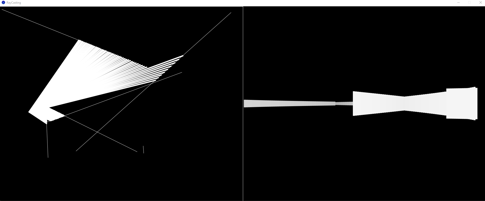

Basic 2D raycasting inspired by the coding train video - [Coding Challenge #145: 2D Raycasting](https://www.youtube.com/watch?v=TOEi6T2mtHo)

Use Mouse to move the src 
Use button A and D to change the view angle

