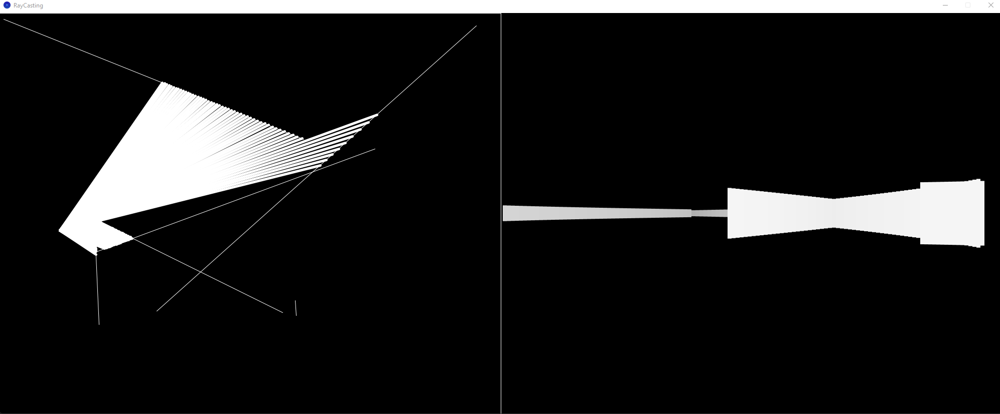

Basic 2D raycasting implemented in Processing, inspired by the Coding Train video - [Coding Challenge #145: 2D Raycasting](https://www.youtube.com/watch?v=TOEi6T2mtHo)

Use the W A S D to move the src. 

